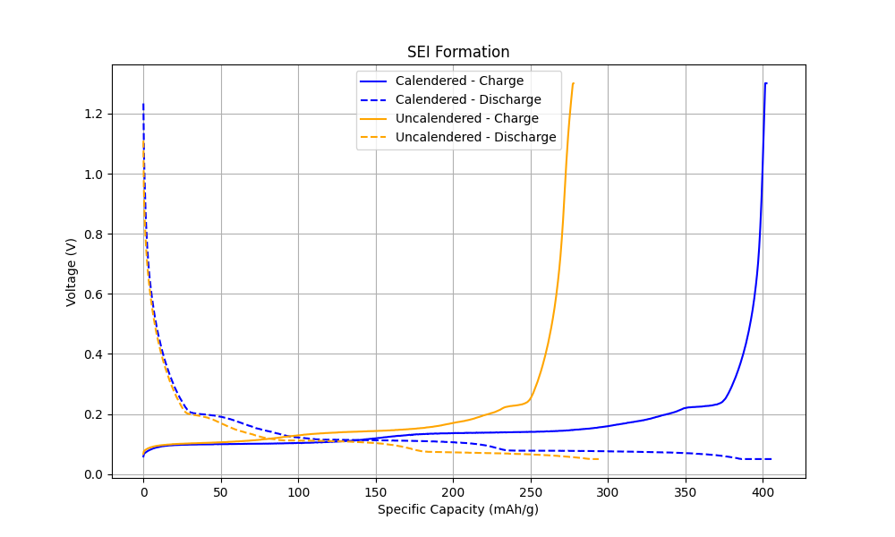
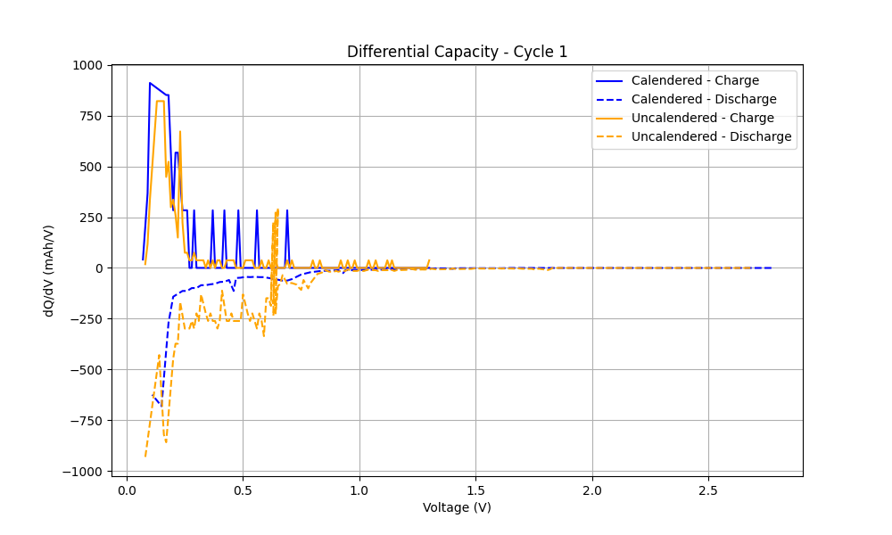
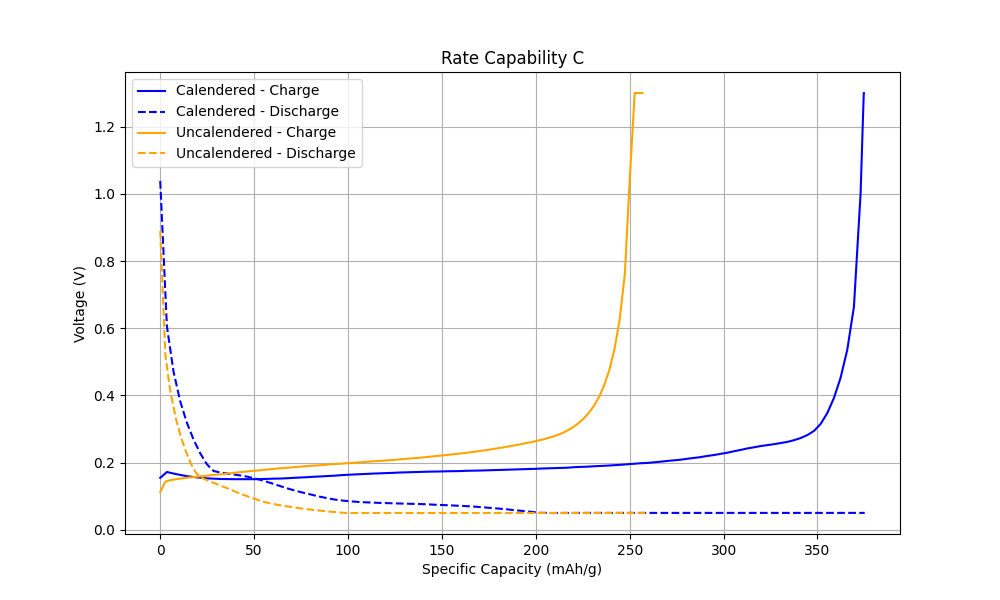
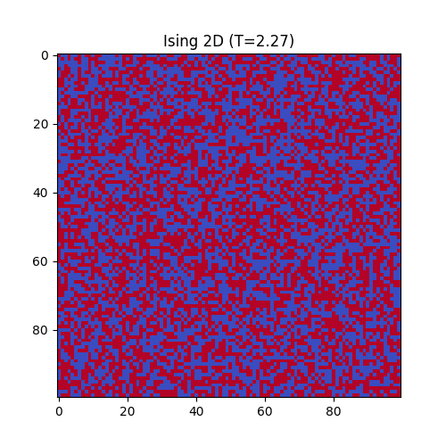

# 🔬 Scientific Computing, Biophysical Simulations & Neural ODEs

A curated, high-performance repository containing advanced computational physics simulations, electrochemical lithium-ion battery analytics, and continuous-depth neural ordinary differential equations (Neural ODEs) trained on real electrophysiology recordings.

---

## 🚀 Repository Showcase

This repository is organized into three major scientific pillars, each leveraging modern numerical computing and machine learning libraries (JAX, PyTorch, Equinox, Pandas, Matplotlib) to model complex dynamical systems.

```
Ncjdod/Projects/
├── 🧠 neural-networks/          # Continuous-depth dynamical systems & neuro-modeling
│   └── neural-ode/
│       ├── fbh-model/          # FitzHugh-Nagumo starter toy model
│       ├── hh-model/           # Hodgkin-Huxley Neural ODE (trajectory fitting)
│       └── hh-field-model/     # Vector Field distillation & Allen Brain fine-tuning
│
├── 🔋 lithium-ion-battery/      # Electrochemical battery cycle analysis & data pipeline
│   ├── data-cleaning/          # Raw data pipelines for electrodes
│   ├── cleaned-data/           # Curated datasets for cycling analysis
│   └── visualizations/         # Charge-discharge curves & dQ/dV profiles
│
└── 🔬 scientific-simulations/  # Classical physics, statistical mechanics & chaos systems
    ├── simulations/            # Ising model, Gray-Scott, Lorenz attractors, PDE heat equation
    └── visualizations/         # Rendered simulation gifs and animations
```

---

## 🧠 1. Neural Ordinary Differential Equations (`neural-networks/`)

Implementing state-of-the-art continuous-depth models in **JAX + Equinox + Diffrax** to learn and simulate complex neural biophysics.

### 🧬 FitzHugh-Nagumo Model (`fbh-model/`)
A starter prototype simulating a simplified 2D excitability model of neural membranes. Features a basic Neural ODE and a Physics-Informed Neural ODE (PINN) designed using Keras with a JAX backend.

### ⚡ Hodgkin-Huxley Neural ODE (`hh-model/`)
Reconstructs the classical 4D Hodgkin-Huxley model state variables $[V, m, h, n]$ representing voltage dynamics and ionic gating variables (sodium and potassium channel activations).
*   **Curriculum Learning**: Progressively scales the simulation time-window to prevent gradient explosion over long trajectories.
*   **Adversarial Physics Loss**: A self-adaptive physics-informed neural network (PINN) optimization loop utilizing a minimax training step to satisfy physical membrane properties.

### 📐 Vector Field Distillation (`hh-field-model/`)
Our current, most advanced approach designed to avoid compilation bottlenecks in highly unrolled layers:
1.  **Phase 1 (Vector Field Distillation)**: Trains `VectorFieldNet` (leveraging explicit stacked weights via `jax.lax.scan` for GPU scaling) to distill the Hodgkin-Huxley equations via regression of state-derivative pairs.
2.  **Phase 2 (Allen Brain Fine-Tuning)**: Fine-tunes the distilled net on real Allen Brain electrophysiology recordings. Learns latent gating variables, integrates anti-forgetting field loss, and learns scale conversions between physical current ($pA$) and normalized density ($\mu A / \text{cm}^2$).

---

## 🔋 2. Lithium-Ion Battery Electrochemical Analysis (`lithium-ion-battery/`)

An analytical pipeline designed to clean raw battery cycler data and extract electrochemical signatures from electrode materials.

*   **Charge-Discharge Curve Analysis**: Visualizes voltage profiles across different cycles to track battery aging, capacity retention, and polarization effects.
*   **Differential Capacity ($dQ/dV$) Profiling**: Differentiates capacity with respect to voltage to identify phase transition peaks, providing a non-destructive window into internal battery degradation mechanisms.
*   **Data Pipelines**: Automatically parses, filters, and standardizes raw datasets from calendered (compressed) and uncalendered electrode materials.

<p align="center">
  
  
  
</p>

---

## 🔬 3. Scientific & Biophysical Simulations (`scientific-simulations/`)

A high-performance sandbox demonstrating key computational methods across statistical mechanics, PDEs, chaotic dynamics, and cognitive systems.

### 🌡️ 2D Ising Model Monte Carlo (`simulations/ising_simulation.py`)
Simulates the ferromagnetism phase transition of a 2D spin lattice at varying temperatures using the Metropolis-Hastings algorithm. Leveraging **JAX JIT-compilation** and **`jax.lax.scan`**, it scales Monte Carlo runs to thousands of steps per frame instantly.

### 🎨 Gray-Scott Reaction-Diffusion (`simulations/gray_scott_model.py`)
Models complex spatial pattern formation (representing cellular division, stripes, and spots) resulting from the reaction and diffusion of two chemical substances ($U$ and $V$). Renders high-quality biological animations.

### 🌪️ Chaos & Hamiltonian Systems (`simulations/`)
*   **Lorenz Attractor (`lorenz_attractor.py`)**: Simulates the classical 3-dimensional chaotic weather pattern.
*   **Hénon-Heiles System (`henon_hailes_system.py`)**: Models a two-dimensional galactic potential to study chaotic orbits and regular trajectories in conservative systems.

### 🕯️ 1D Heated Rod PDE (`simulations/heated_rod_1d.py`)
Solves the classical Partial Differential Equation (PDE) for heat conduction using finite-difference numerical integration, demonstrating thermal stabilization over time.

### 🧠 Synaptic Plasticity System (`simulations/binary_hebbian_system.py`)
A simulated cognitive system demonstrating basic Hebbian synaptic learning, showing how weight matrices evolve dynamically according to input spike associations.

---

## 🖼️ Simulation Visual Gallery

Here are live renders of key physics simulations showing phase transitions and reaction-diffusion kinetics:

<p align="center">
  
  &nbsp;&nbsp;
  
</p>

---

## 🛠️ Environment & Setup

To run the scientific and neural network models, clone the repository and install the scientific Python stack:

```bash
# Clone the repository
git clone https://github.com/Ncjdod/Projects.git
cd Projects

# Install core scientific packages
pip install numpy scipy pandas matplotlib

# Install JAX and machine learning stack (adjust for CUDA if GPU is available)
pip install jax optax diffrax equinox h5py
```

### Run a Physics Simulation
```bash
cd scientific-simulations/simulations
python ising_simulation.py
```

### Run Neural ODE Vector Field Training
```bash
cd neural-networks/neural-ode/hh-field-model
python train_field.py --from_scratch
```
